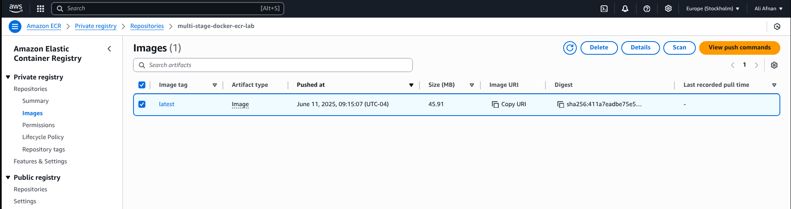
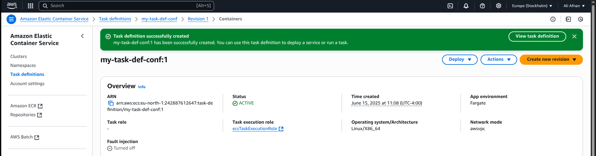
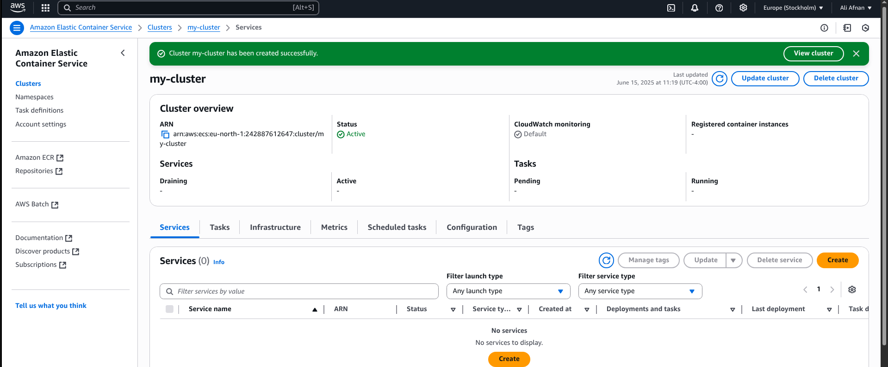
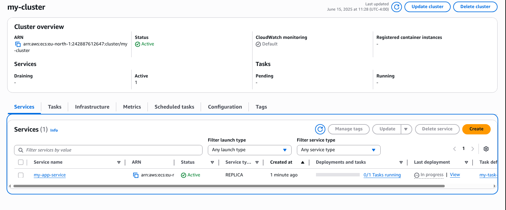
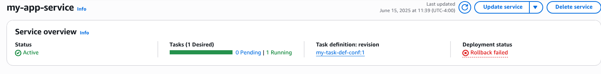
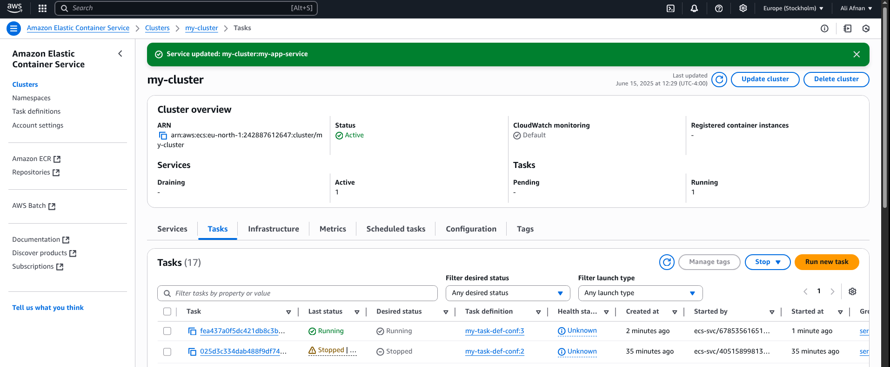
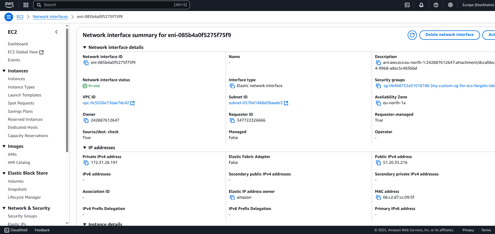
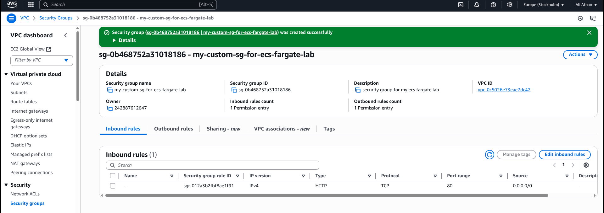
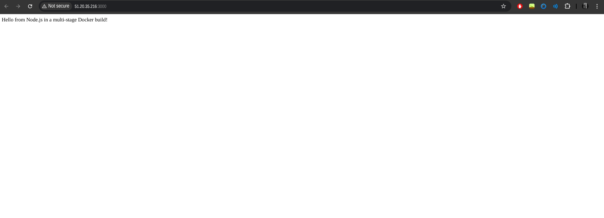

# 🚀 Lab : Deploy Docker App on AWS ECS Using Fargate

This project demonstrates how to deploy a Dockerized web application using **Amazon ECS (Elastic Container Service)** with the **Fargate launch type** and a Docker image hosted on **Amazon ECR (Elastic Container Registry)**. The goal is to build a serverless containerized architecture that can be accessed from the web browser without provisioning EC2 instances.

---

## 🎯 Objective

- Use Docker image from Lab 1 (already pushed to ECR)
- Create ECS Task Definition using the **Fargate** launch type
- Create an ECS Cluster and Service
- Configure security groups and networking for public access
- Deploy and verify the app using a browser

---

## 🧠 Concepts Covered

| Concept              | Description                                                                 |
|----------------------|-----------------------------------------------------------------------------|
| **Amazon ECR**       | Private Docker image registry to store your container images                |
| **Amazon ECS**       | Managed service to run containerized applications at scale                  |
| **Fargate**          | Serverless compute engine to run containers without managing servers        |
| **Task Definition**  | Blueprint for running containers (image, ports, memory, CPU)                |
| **Service**          | Ensures the required number of container tasks are always running           |
| **Security Groups**  | Virtual firewalls to control traffic to containers                          |
| **VPC & Subnets**    | Network environment that provides IPs and routing for container tasks       |

---

## 🛠️ Walkthrough

### ✅ 1. Use Docker Image from ECR
- Verified that the image was successfully pushed to **Amazon ECR**
- Copied the full image URI to use in ECS Task Definition

### ✅ 2. Create ECS Task Definition
- Launch type: **Fargate**
- Container image: `123456789012.dkr.ecr.us-east-1.amazonaws.com/my-app:latest`
- CPU/Memory: `0.5 vCPU`, `1 GB`
- Port mapping: **3000**

### ✅ 3. Create ECS Cluster and Service
- ECS Cluster created with **Fargate networking only**
- ECS Service created using the Task Definition
- Number of desired tasks: **1**
- Auto-assign public IP: **Enabled**

### ✅ 4. Configure Security Groups
- Inbound Rule:
  - Type: Custom TCP
  - Port:3000
  - Source: 0.0.0.0/0 (for public access)
- Security group attached to ECS service

### ✅ 5. Deploy and Access Application
- Task launched successfully in ECS Service
- Public IP retrieved from **task networking details**
- Accessed app in browser using:  
  `http://51.20.35.216:3000/`

---

## 🖼️ Screenshots

| Step | Description | Image |
|------|-------------|-------|
| 1 | Docker image in ECR |  |
| 2 | Task Definition in ECS |  |
| 3 | ECS Cluster creation |  |
| 4 | ECS Service summary |  |
| 5 | Running Service in ECS |  |
| 6 | Task details with public IP |  |
| 7 | ENI summary |  |
| 8 | Security group with open port |  |
| 9 | App running in browser |  |

---

## 🌐 Application URL

After deployment, the app was accessible from:

```bash
http://51.20.35.216:3000/
```


## ✅ Summary: Errors I Faced & Fixes I Applied
# 🐛 1. ECS Task Failed to Start
Error Message: Essential container in task exited

Root Cause: The container crashed because it couldn’t run the app.

Fix: Investigated logs via docker run and found the real error.

# 🐛 2. Cannot find module '/app/app.js'
Error Message in logs: Error: Cannot find module '/app/app.js'

Root Cause: my app file was named node.js, but package.json was set to run app.js.

Fix: Renamed node.js → app.js to match the start script in package.json.

# 🐛 3. ECS Task Still Not Running
Cause: Old image with the error was still being used by ECS.

Fix: Rebuilt Docker image, tagged it, pushed it to ECR, created a new Task Definition revision, and forced a new ECS deployment.

# 🐛 4. no basic auth credentials during Docker push
Error Message: no basic auth credentials
Root Cause: Docker was not authenticated with AWS ECR.
Fix: Logged into ECR with:
aws ecr get-login-password --region eu-north-1 | docker login --username AWS --password-stdin <repo-url>

## ✅ Final Result:

ECS Task is running

App is live at http://51.20.35.216:3000

Docker image is fixed and uploaded to ECR

ECS service uses the correct task and image

